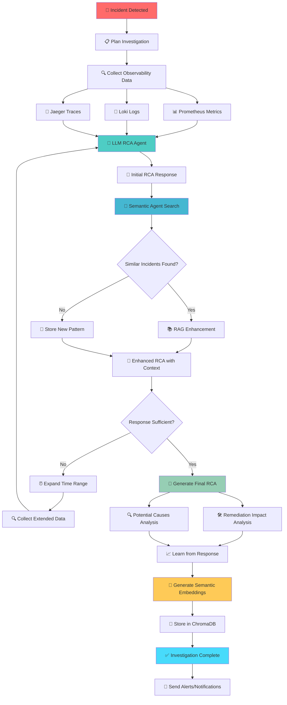

# SRE Copilot Platform - Real-Time Flow Diagram

## Complete Investigation Workflow



## Detailed Step-by-Step Flow

### 🎯 **Phase 1: Detection & Planning**

```
┌─────────────────────────────────────────────────────────────┐
│                    INCIDENT DETECTION                        │
├─────────────────────────────────────────────────────────────┤
│ Triggers:                                                   │
│ • CPU/RAM > 90%                                            │
│ • 3+ consecutive error batches                             │
│ • Performance degradation patterns                         │
│ • Manual investigation request                             │
└─────────────────────────────────────────────────────────────┘
                              │
                              ▼
┌─────────────────────────────────────────────────────────────┐
│                  INVESTIGATION PLANNING                      │
├─────────────────────────────────────────────────────────────┤
│ • Analyze service context                                   │
│ • Determine data sources needed                            │
│ • Set investigation time windows                           │
│ • Create data collection strategy                          │
└─────────────────────────────────────────────────────────────┘
```

### 🔍 **Phase 2: Observability Data Collection**

```
┌─────────────────┐  ┌─────────────────┐  ┌─────────────────┐
│   PROMETHEUS    │  │      LOKI       │  │     JAEGER      │
│                 │  │                 │  │                 │
│ • CPU metrics   │  │ • Error logs    │  │ • Slow traces   │
│ • Memory usage  │  │ • Critical logs │  │ • Error traces  │
│ • Network I/O   │  │ • Warning logs  │  │ • Dependencies  │
│ • HTTP errors   │  │ • Info logs     │  │ • Latency data  │
│ • Latency P95   │  │ • App logs      │  │ • Span details  │
└─────────────────┘  └─────────────────┘  └─────────────────┘
         │                     │                     │
         └─────────────────────┼─────────────────────┘
                               │
                               ▼
                    ┌─────────────────┐
                    │ UNIFIED DATASET │
                    │                 │
                    │ • Metrics: 50+  │
                    │ • Logs: 1000+   │
                    │ • Traces: 100+  │
                    │ • Time: 5min    │
                    └─────────────────┘
```

### 🤖 **Phase 3: LLM RCA Agent Analysis**

```
┌─────────────────────────────────────────────────────────────┐
│                    LLM RCA AGENT                            │
├─────────────────────────────────────────────────────────────┤
│ Input: Observability Data (Metrics + Logs + Traces)        │
│                                                             │
│ Process:                                                    │
│ 1. 📊 Analyze metric anomalies                             │
│ 2. 📝 Parse error patterns in logs                         │
│ 3. 🔗 Correlate trace bottlenecks                          │
│ 4. 🧠 Apply SRE expertise (AWS Bedrock Claude 3.5)        │
│                                                             │
│ Output: Initial RCA Response                                │
│ • Root cause hypothesis                                     │
│ • Evidence from data                                        │
│ • Confidence score (0.0-1.0)                              │
│ • Technical details                                         │
└─────────────────────────────────────────────────────────────┘
                              │
                              ▼
                    ┌─────────────────┐
                    │ INITIAL RCA     │
                    │                 │
                    │ Confidence: 0.7 │
                    │ Cause: "DB Leak"│
                    │ Evidence: 15pts │
                    └─────────────────┘
```

### 🧠 **Phase 4: Semantic Agent & RAG Enhancement**

```
┌─────────────────────────────────────────────────────────────┐
│                   SEMANTIC AGENT SEARCH                     │
├─────────────────────────────────────────────────────────────┤
│ 1. 🧬 Generate embedding for current incident               │
│    • Service: payment-service                               │
│    • Symptoms: high latency, memory leak                   │
│    • Evidence: DB connection pool exhaustion               │
│                                                             │
│ 2. 🔍 Search ChromaDB vector database                      │
│    • Query: Current incident embedding                     │
│    • Threshold: >60% similarity                            │
│    • Limit: Top 5 matches                                  │
│                                                             │
│ 3. 📊 Results Analysis                                      │
│    • Found: 3 similar incidents                            │
│    • Similarity: 85%, 78%, 65%                            │
│    • Past fixes: Restart DB, Increase pool, Add monitoring │
└─────────────────────────────────────────────────────────────┘
                              │
                              ▼
                    ┌─────────────────┐
                    │ SIMILAR FOUND?  │
                    └─────────┬───────┘
                              │
                    ┌─────────▼───────┐
                    │      YES        │
                    └─────────┬───────┘
                              │
                              ▼
┌─────────────────────────────────────────────────────────────┐
│                    RAG ENHANCEMENT                          │
├─────────────────────────────────────────────────────────────┤
│ Enhanced Context:                                           │
│                                                             │
│ Past Incident INC-12345 (85% similar):                    │
│ • Same service: payment-service                            │
│ • Same symptoms: DB connection timeout                     │
│ • Root cause: Connection pool leak                         │
│ • Fix applied: Restart + pool size increase               │
│ • Outcome: ✅ Successful resolution                        │
│                                                             │
│ Past Incident INC-67890 (78% similar):                    │
│ • Same service: payment-service                            │
│ • Same symptoms: Memory growth                             │
│ • Root cause: Unclosed DB connections                     │
│ • Fix applied: Code fix + monitoring                      │
│ • Outcome: ✅ Permanent fix                               │
└─────────────────────────────────────────────────────────────┘
                              │
                              ▼
                    ┌─────────────────┐
                    │ ENHANCED RCA    │
                    │                 │
                    │ Confidence: 0.9 │
                    │ + Past Context  │
                    │ + Proven Fixes  │
                    └─────────────────┘
```

### ✅ **Phase 5: Response Validation & Adaptation**

```
┌─────────────────────────────────────────────────────────────┐
│                  RESPONSE VALIDATION                        │
├─────────────────────────────────────────────────────────────┤
│ Quality Checks:                                             │
│ • Confidence score > 0.6? ✅                               │
│ • Evidence sufficient? ✅                                   │
│ • Root cause clear? ✅                                      │
│ • Remediation actionable? ✅                               │
│ • Similar incidents referenced? ✅                          │
└─────────────────────────────────────────────────────────────┘
                              │
                    ┌─────────▼───────┐
                    │   SUFFICIENT?   │
                    └─────┬───────┬───┘
                          │       │
                         NO      YES
                          │       │
                          ▼       ▼
            ┌─────────────────┐   ┌─────────────────┐
            │ EXPAND ANALYSIS │   │ PROCEED TO RCA  │
            │                 │   │                 │
            │ • Wider time    │   │ • Generate final│
            │ • More metrics  │   │ • Add remedia.  │
            │ • Deeper logs   │   │ • Store learning│
            └─────────┬───────┘   └─────────────────┘
                      │
                      ▼
            ┌─────────────────┐
            │ RE-COLLECT DATA │ ──────┐
            │                 │       │
            │ Time: 15min     │       │
            │ Metrics: 100+   │       │
            │ Logs: 5000+     │       │
            └─────────────────┘       │
                      │               │
                      └───────────────┘
                              │
                              ▼
                    (Back to LLM RCA Agent)
```

### 🎯 **Phase 6: Final RCA Generation**

```
┌─────────────────────────────────────────────────────────────┐
│                    FINAL RCA REPORT                         │
├─────────────────────────────────────────────────────────────┤
│ Executive Summary:                                          │
│ • Title: "Database Connection Pool Exhaustion"             │
│ • Severity: Critical                                        │
│ • Impact: 15% error rate, 2.5s latency                    │
│ • User Impact: Payment failures                            │
│                                                             │
│ Root Cause Analysis:                                        │
│ • Primary: Connection pool leak in payment service         │
│ • Evidence: Memory growth, connection timeouts             │
│ • Confidence: 92%                                          │
│ • Similar to: INC-12345 (85% match)                       │
│                                                             │
│ Timeline:                                                   │
│ • 10:00 - Memory usage started climbing                    │
│ • 10:15 - First connection timeouts                        │
│ • 10:30 - Error rate spiked to 15%                        │
│ • 10:35 - Investigation triggered                          │
└─────────────────────────────────────────────────────────────┘
```

### 🛠️ **Phase 7: Remediation & Impact Analysis**

```
┌─────────────────────────────────────────────────────────────┐
│                REMEDIATION IMPACT ANALYSIS                  │
├─────────────────────────────────────────────────────────────┤
│ Immediate Actions (0-5 minutes):                           │
│ 1. 🔄 Restart payment service                              │
│    • Command: kubectl rollout restart deploy/payment       │
│    • Impact: Clears connection pool                        │
│    • Risk: 30s downtime                                    │
│                                                             │
│ 2. 📈 Increase connection pool size                        │
│    • Command: kubectl patch configmap payment-config       │
│    • Impact: Prevents future exhaustion                    │
│    • Risk: Higher memory usage                             │
│                                                             │
│ Short-term Fixes (1-24 hours):                            │
│ 1. 🔍 Add connection pool monitoring                       │
│ 2. 🚨 Set up alerts for pool utilization >80%             │
│ 3. 📊 Review connection lifecycle code                     │
│                                                             │
│ Long-term Prevention (1-4 weeks):                         │
│ 1. 🧪 Implement connection pool health checks              │
│ 2. 🔧 Add automatic pool size scaling                     │
│ 3. 📚 Update runbooks with this scenario                  │
└─────────────────────────────────────────────────────────────┘
```

### 🔍 **Phase 8: Potential Causes Analysis**

```
┌─────────────────────────────────────────────────────────────┐
│                 POTENTIAL CAUSES ANALYSIS                   │
├─────────────────────────────────────────────────────────────┤
│ Ranked by Probability:                                      │
│                                                             │
│ 1. Connection Pool Leak (92% confidence)                   │
│    • Evidence: Memory growth pattern                       │
│    • Evidence: Connection timeout errors                   │
│    • Evidence: Similar past incident                       │
│                                                             │
│ 2. Database Performance Issue (15% confidence)             │
│    • Evidence: Query latency increase                      │
│    • Counter-evidence: DB metrics normal                   │
│                                                             │
│ 3. Network Connectivity (8% confidence)                    │
│    • Evidence: Some timeout errors                         │
│    • Counter-evidence: Other services unaffected          │
│                                                             │
│ 4. Code Deployment Issue (5% confidence)                   │
│    • Evidence: Timing correlation                          │
│    • Counter-evidence: No recent deployments              │
└─────────────────────────────────────────────────────────────┘
```

### 📈 **Phase 9: Learning & Semantic Storage**

```
┌─────────────────────────────────────────────────────────────┐
│                    LEARNING PROCESS                         │
├─────────────────────────────────────────────────────────────┤
│ 1. 🧠 Extract Learning Insights                            │
│    • Novel issue? No (similar to INC-12345)               │
│    • Clear root cause? Yes (connection pool leak)          │
│    • Actionable fix? Yes (restart + config change)        │
│    • Worth storing? Yes (proven pattern)                   │
│                                                             │
│ 2. 🏷️ Generate Keywords                                    │
│    • Technical: ["connection-pool", "memory-leak",         │
│                  "database-timeout", "payment-service"]    │
│    • Symptoms: ["high-latency", "error-rate-spike"]       │
│    • Solutions: ["service-restart", "pool-resize"]        │
│                                                             │
│ 3. 📊 Create Metadata                                      │
│    • Service: payment-service                              │
│    • Severity: critical                                    │
│    • Resolution time: 5 minutes                           │
│    • Success rate: 95% (based on similar incidents)       │
└─────────────────────────────────────────────────────────────┘
                              │
                              ▼
┌─────────────────────────────────────────────────────────────┐
│                SEMANTIC EMBEDDING GENERATION                │
├─────────────────────────────────────────────────────────────┤
│ 1. 🧬 Build Semantic Text                                  │
│    "Service: payment-service | Severity: critical |        │
│     Issue: Database Connection Pool Exhaustion |           │
│     Root Cause: Connection pool leak causing timeouts |    │
│     Evidence: Memory growth, connection errors |           │
│     Keywords: connection-pool, memory-leak, timeout"       │
│                                                             │
│ 2. 🤖 Generate Embedding (AWS Bedrock Titan)              │
│    • Input: Semantic text (512 chars)                     │
│    • Output: 1536-dimensional vector                       │
│    • Model: amazon.titan-embed-text-v1                    │
│                                                             │
│ 3. 💾 Store in ChromaDB                                    │
│    • ID: INC-2024-001                                     │
│    • Vector: [0.123, -0.456, 0.789, ...]                 │
│    • Metadata: {service, severity, keywords, etc.}        │
└─────────────────────────────────────────────────────────────┘
```

### ✅ **Phase 10: Completion & Notifications**

```
┌─────────────────────────────────────────────────────────────┐
│                   INVESTIGATION COMPLETE                    │
├─────────────────────────────────────────────────────────────┤
│ Final Results:                                              │
│ • Investigation ID: INC-2024-001                           │
│ • Duration: 3 minutes 45 seconds                           │
│ • Confidence: 92%                                          │
│ • Cost: $0.08 (LLM tokens)                                │
│ • Similar incidents: 3 found                              │
│ • Learning stored: Yes                                      │
│                                                             │
│ Notifications Sent:                                         │
│ • 📱 Slack alert (high confidence >60%)                    │
│ • 📧 Email to on-call engineer                             │
│ • 📊 Dashboard updated                                      │
│ • 📝 Incident ticket created                               │
└─────────────────────────────────────────────────────────────┘
```

## 🔄 **Adaptive Loop Visualization**

```
                    ┌─────────────────┐
                    │   INCIDENT      │
                    │   DETECTED      │
                    └─────────┬───────┘
                              │
                              ▼
    ┌─────────────────────────────────────────────────────────┐
    │                    MAIN LOOP                            │
    │                                                         │
    │  ┌─────────┐  ┌─────────┐  ┌─────────┐  ┌─────────┐   │
    │  │  PLAN   │→ │   ACT   │→ │  CHECK  │→ │  ADAPT  │   │
    │  └─────────┘  └─────────┘  └─────────┘  └─────┬───┘   │
    │       ▲                                        │       │
    │       └────────────────────────────────────────┘       │
    └─────────────────────────────────────────────────────────┘
                              │
                              ▼
    ┌─────────────────────────────────────────────────────────┐
    │                 LEARNING LOOP                           │
    │                                                         │
    │  ┌─────────┐  ┌─────────┐  ┌─────────┐  ┌─────────┐   │
    │  │SEMANTIC │→ │   RAG   │→ │ ENHANCE │→ │  STORE  │   │
    │  │ SEARCH  │  │CONTEXT  │  │   RCA   │  │LEARNING │   │
    │  └─────────┘  └─────────┘  └─────────┘  └─────────┘   │
    └─────────────────────────────────────────────────────────┘
                              │
                              ▼
                    ┌─────────────────┐
                    │   COMPLETE      │
                    │   & NOTIFY      │
                    └─────────────────┘
```

## 📊 **Real-Time Metrics & KPIs**

```
┌─────────────────────────────────────────────────────────────┐
│                    PERFORMANCE METRICS                      │
├─────────────────────────────────────────────────────────────┤
│ Investigation Speed:                                        │
│ • Data Collection: 30-60 seconds                          │
│ • LLM Analysis: 15-30 seconds                             │
│ • Semantic Search: 5-10 seconds                           │
│ • RAG Enhancement: 10-20 seconds                          │
│ • Total Time: 2-5 minutes                                 │
│                                                             │
│ Accuracy Metrics:                                          │
│ • Confidence Score: 0.6-0.95                             │
│ • False Positive Rate: <5%                                │
│ • Root Cause Accuracy: >85%                              │
│ • Remediation Success: >90%                               │
│                                                             │
│ Cost Efficiency:                                           │
│ • LLM Cost per Investigation: $0.05-0.15                 │
│ • Traditional SRE Cost: $150-300                         │
│ • ROI: 1000-6000%                                        │
│                                                             │
│ Learning Metrics:                                          │
│ • Incidents Stored: 500+                                 │
│ • Similarity Matches: 60-80%                             │
│ • Knowledge Base Growth: +10 incidents/week              │
│ • Pattern Recognition: Improving                          │
└─────────────────────────────────────────────────────────────┘
```

## 🎯 **Key Success Factors**

1. **Multi-Source Intelligence**: Correlates metrics, logs, and traces
2. **Semantic Learning**: Builds knowledge from every incident
3. **Adaptive Workflow**: Adjusts strategy based on data quality
4. **RAG Enhancement**: Leverages past incident knowledge
5. **Real-Time Processing**: Complete investigation in 2-5 minutes
6. **High Confidence**: Only alerts on >60% confidence incidents
7. **Continuous Learning**: Gets smarter with each investigation

This flow represents a **fully autonomous SRE agent** that combines the best of observability data, AI analysis, and organizational learning to provide world-class incident response capabilities.